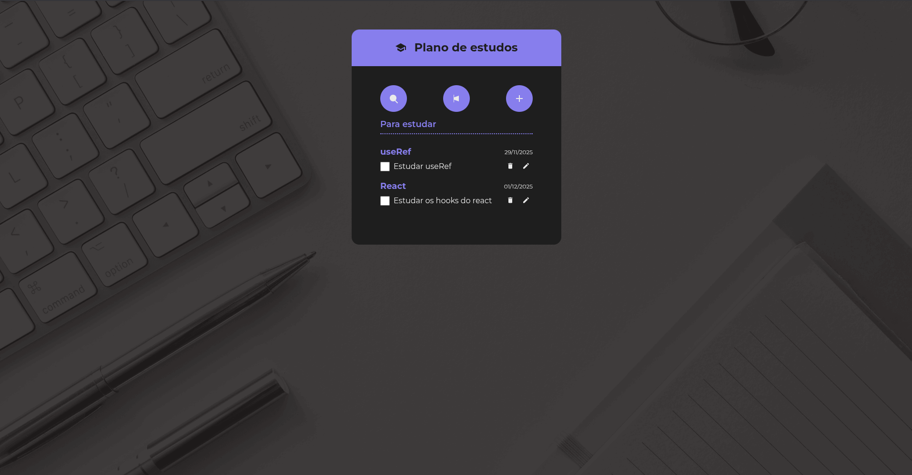
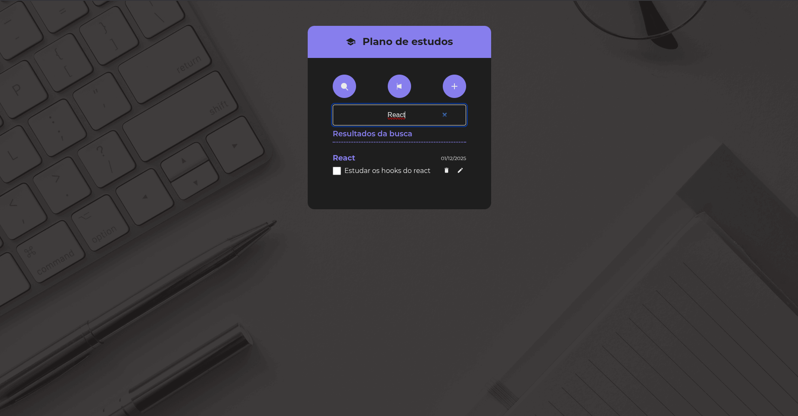
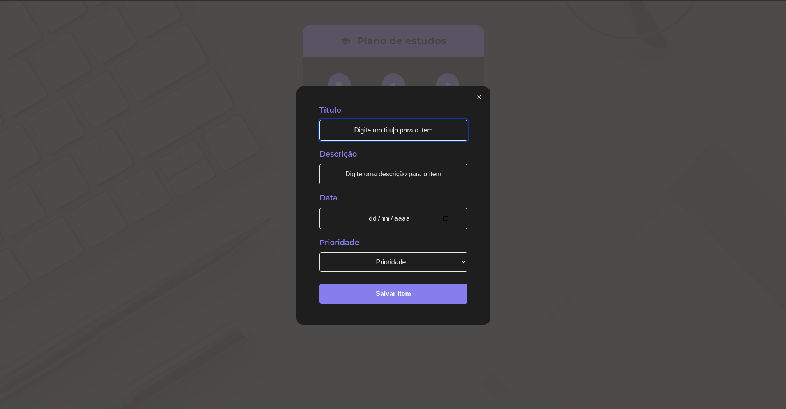
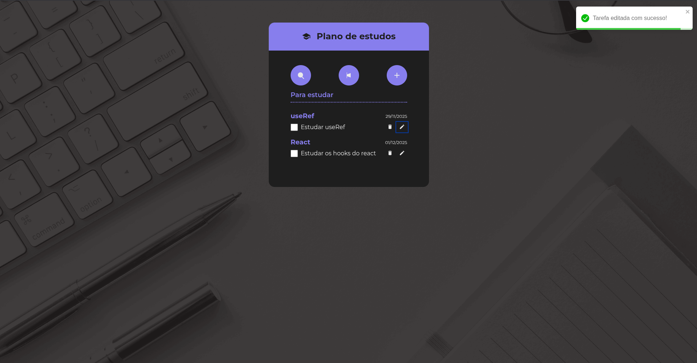

# App de Checklist de Estudos

Aplicação React para gerenciar tarefas de estudo (criar, editar, remover, marcar como concluídas), com filtros, busca, prioridade e feedback visual.

---

## 💻 Tecnologias Utilizadas

- React (hooks: useState, useEffect, useContext)
- Vite (dev server / build)
- CSS (estilos organizados por componente; classes simples)
- SVGs inline para ícones (components/icons)
- localStorage para persistência de dados (hooks/useEffect)
- Implementações internas:
  - react-toastify - para exibir feedback ao usuário
  - Dialog (modal acessível)

---

## 🧱 Estrutura do Projeto

- src/
  - App.jsx
  - index.css
  - main.jsx
  - components/ (todas as pastas com o arquivo jsx e o arquivo de estilos CSS)
    - Button/
    - ChecklistsWrapper/
    - ChecklistsWrapperHeader/
    - Container/
    - DateInput/
    - Dialog/
    - EmptyState/
    - FabButton/
    - Header/
    - Heading/
    - icons/ (vários ícones: IconSearch, IconPlus, IconTrash, IconSchool, IconPencil, IconClose, IconHighPriority)
    - LabelInput/
    - SelectInput/
    - SubHeading/
    - TextInput/
    - TodoForm/
    - TodoGroup/
    - TodoItem/
    - TodoList/
    - TodoProvider/ (Contexto da aplicação para os todos)

---

## 📸 Prévia do Projeto

---

## 🧩 Principais Conceitos Aplicados

- Componentização: cada responsabilidade em um componente (Single Responsibility).
- Hooks do React: gerenciamento local (useState), efeitos (useEffect) e contexto (useContext).
- Acessibilidade (melhorias aplicadas / sugeridas):
  - SVGs com role/title/aria-label/aria-hidden.
  - Botões toggles com aria-pressed.
  - Diálogo com role="dialog" e gerenciamento de foco (recomendado focus-trap).
  - Inputs com id/label ou aria-label;
- Persistência: salvar/ler do localStorage para manter tarefas entre sessões.
- Feedback ao usuário: toast para sucesso/erro, empty-state quando não há tarefas.
- Tratamento de erros: recomenda-se envolver operações assíncronas com try/catch e exibir erros via toast.

---

## 💻 Requisitos funcionais
- Criar uma nova tarefa (com título e descrição obrigatórios, data e prioridade opcionais).
- Editar uma tarefa existente.
- Remover uma tarefa.
- Marcar/desmarcar tarefa como concluída.
- Filtrar tarefas por:
  - Estado: pendentes / concluídas.
  - Prioridade alta.
  - Busca por título (case-insensitive).
- Modal para adicionar/editar tarefa.
- Exibir mensagem (toast) de sucesso/erro ao criar/editar/remover.
- Empty state quando não houver tarefas.

---

## 💻 Requisitos não funcionais
- Responsividade: UI adapta-se a telas pequenas e grandes.
- Performance: renderizações otimizadas (listas simples, filtragens locais).
- Acessibilidade (WCAG básico):
  - Elementos semânticos: header, main, footer.
  - Controle de foco em modais.
  - Labels para inputs / aria attributes em controles.
  - Contraste e indicadores de foco visível.
- Persistência: usar localStorage para manter estado entre sessões.
- Manutenibilidade: código organizado por componentes e estilo consistente.

---

## ⚙️ Como Executar Localmente
1. Instalar dependências:
   npm install
2. Rodar em desenvolvimento:
   npm run dev
3. Acessar:
   http://localhost:5173

---

## ⚙️ Links Úteis

https://react.dev/  
https://www.npmjs.com/package/react-toastify  